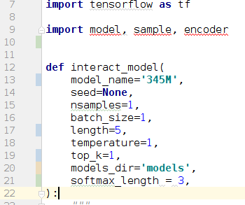

## Getting started
In order to start generating samples,

1. Download a model size (choose 117M, 345M, 774M, 1558M [which may be too large to run for some computers])
> python3 download_model.py 117M
Or run download_model.py but change the variable "model"

2. Change interactive_conditional_samples.py parameters

* Change "model_name" to the one you downloaded
* Read the comments for further details, but of interest is the number of generated tokens (length), the number of considered tokens (top_k), and top N tokens by probability (softmax_length)

3. Run interactive_conditional_samples.py
You can run it from the root directory like
> python3 src/interactive_conditional_samples.py
Or, you can change the directory variable at the bottom of the file


# -Original ReadMe-
# gpt-2

Code from the paper ["Language Models are Unsupervised Multitask Learners"](https://d4mucfpksywv.cloudfront.net/better-language-models/language-models.pdf).

We have currently released small (117M parameter) and medium (345M parameter) versions of GPT-2.  While we have not released the larger models, we have [released a dataset](https://github.com/openai/gpt-2-output-dataset) for researchers to study their behaviors.

See more details in our [blog post](https://blog.openai.com/better-language-models/).

## Usage

This repository is meant to be a starting point for researchers and engineers to experiment with GPT-2.

### Some caveats

- GPT-2 models' robustness and worst case behaviors are not well-understood.  As with any machine-learned model, carefully evaluate GPT-2 for your use case, especially if used without fine-tuning or in safety-critical applications where reliability is important.
- The dataset our GPT-2 models were trained on contains many texts with [biases](https://twitter.com/TomerUllman/status/1101485289720242177) and factual inaccuracies, and thus GPT-2 models are likely to be biased and inaccurate as well.
- To avoid having samples mistaken as human-written, we recommend clearly labeling samples as synthetic before wide dissemination.  Our models are often incoherent or inaccurate in subtle ways, which takes more than a quick read for a human to notice.

### Work with us

Please [let us know](mailto:languagequestions@openai.com) if you’re doing interesting research with or working on applications of GPT-2!  We’re especially interested in hearing from and potentially working with those who are studying
- Potential malicious use cases and defenses against them (e.g. the detectability of synthetic text)
- The extent of problematic content (e.g. bias) being baked into the models and effective mitigations

## Development

See [DEVELOPERS.md](./DEVELOPERS.md)

## Contributors

See [CONTRIBUTORS.md](./CONTRIBUTORS.md)

## Citation

Please use the following bibtex entry:
```
@article{radford2019language,
  title={Language Models are Unsupervised Multitask Learners},
  author={Radford, Alec and Wu, Jeff and Child, Rewon and Luan, David and Amodei, Dario and Sutskever, Ilya},
  year={2019}
}
```

## Future work

We may release code for evaluating the models on various benchmarks.

We are still considering release of the larger models.

## License

[MIT](./LICENSE)
